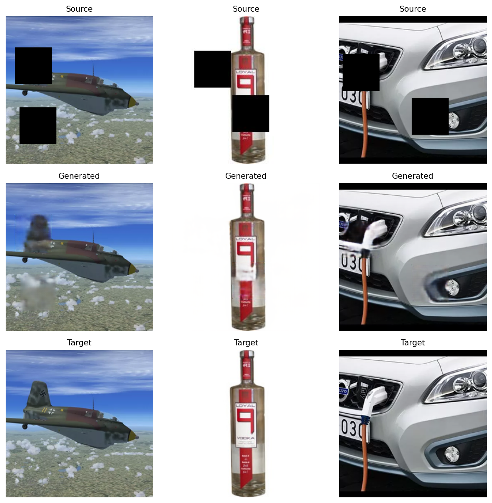
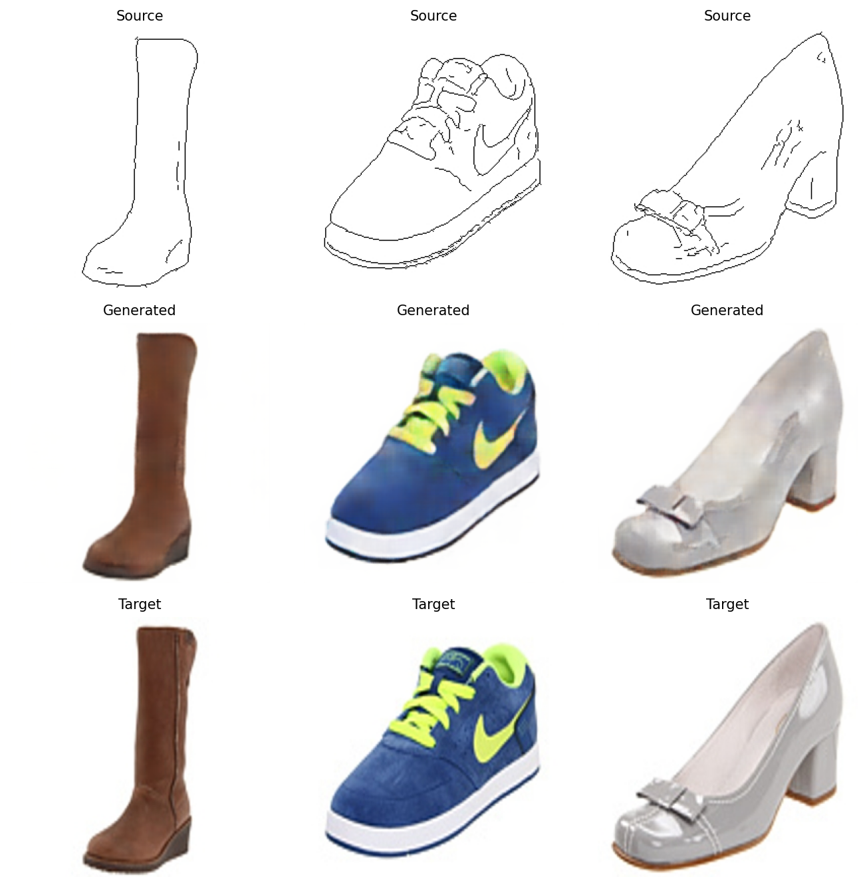
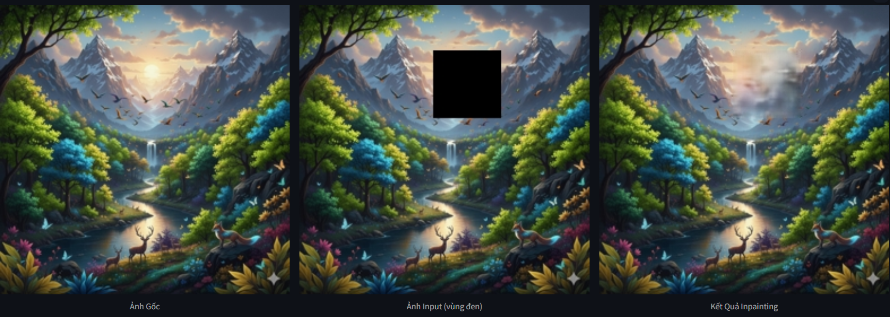
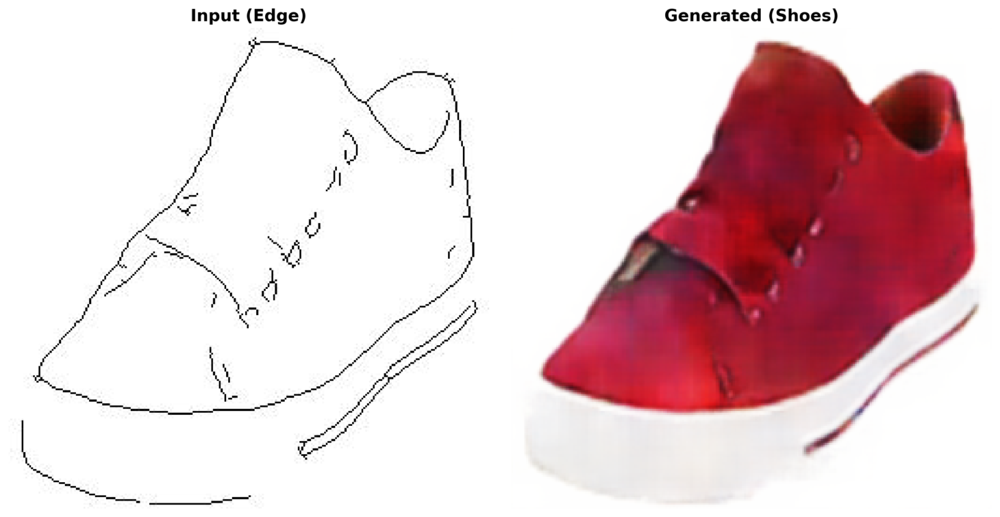

# 🎨 AI Image-to-Image Demo using Pix2Pix GANs

This repository demonstrates **two deep learning models** built on the **Pix2Pix Generative Adversarial Network (GAN)** architecture:
- 👟 **Edge2Shoes**: Converts shoe edge/sketch images into realistic shoes.  
- 🎨 **Inpainting Model**: Fills in missing or masked regions in an image.

Built with **TensorFlow** and deployed via **Streamlit** for an interactive web interface.

---

## 🚀 Features

### 🖌️ 1. Inpainting Model
- Remove unwanted regions and let AI fill in the blanks.  
- Interactive canvas allows drawing masks directly on the uploaded image.  

### 👟 2. Edge2Shoes Model
- Converts line drawings (edges) of shoes into photorealistic shoe images.  
- Supports `.jpg`, `.jpeg`, and `.png` files with automatic preprocessing to 256×256 pixels.

---

## 🧠 Model Architecture

| Model      | Input                 | Output               | Framework          | Type        |
|------------|-----------------------|----------------------|--------------------|-------------|
| Edge2Shoes | Edge/Sketch (256×256) | Realistic Shoe Image | TensorFlow / Keras | Pix2Pix GAN |
| Inpainting | Masked Image (256×256)| Completed Image      | TensorFlow / Keras | Pix2Pix GAN |

Both models utilize the **U-Net generator** and **PatchGAN discriminator** for image-to-image translation.

---

## 🧬 Project Structure

```
📦 AI-Image2Image-Demo
├── Models/
│   ├── Edge2Shoes_epoch_341.h5
│   └── Inpainting_epoch_741.h5
├── TH1.py                # Main Streamlit app
├── requirements.txt      # Dependencies
├── README.md             # Project documentation
└── Assets/               # Test images
├── kaggleDataset.txt     # Dataset source links
├── edge2shoes.ipynb      # Training notebook for Edge2Shoes model
├── inpainting.ipynb      # Training notebook for Inpainting model
```

---

## 🛠️ Installation

Clone the repository and install dependencies:

```bash
git clone https://github.com/thangnguyen13112004/gan-image-synthesis.git
cd gan-image-synthesis
pip install -r requirements.txt
```

or install manually:

```bash
pip install streamlit tensorflow opencv-python pillow matplotlib streamlit-drawable-canvas
```

---

## ▶️ Run the Demo

Run locally with Streamlit:

```bash
streamlit run TH1.py
```

Then open the provided local URL (default: http://localhost:8501).

---

## 💡 How to Use

### 🎨 Inpainting Model
1. Upload an image (`.jpg`, `.png`).  
2. Draw over regions to remove using brush/rectangle/circle tools.  
3. Click **“Run Inpainting”** to let AI fill the masked region.  
4. Download both input (masked) and output (completed) images.

### 👟 Edge2Shoes Model
1. Upload an edge/sketch image of a shoe.  
2. Click **“Vẽ Giày / Generate Shoes”**.  
3. View side-by-side comparison of input and generated results.  
4. Expand “📊 Detailed Info” for tensor shape and model metadata.

---

## 🧮 Tech Stack

- **Frontend:** Streamlit UI + Drawable Canvas  
- **Backend:** TensorFlow / Keras  
- **Libraries:** NumPy, Pillow, OpenCV, Matplotlib  
- **Models:** Pix2Pix GANs  

---

## 📸 Screenshots

🧠 Training Samples

Inpainting Model (Training Phase)


Edge2Shoes Model (Training Phase)


🧩 Test Results
Inpainting Demo


Edge2Shoes Demo


---

## 📊 Model Information

| Model      |Epoch|Input Size|     Framework      |             Description                   |
|------------|-----|----------|--------------------|-------------------------------------------|
| Inpainting | 741 | 256×256  | TensorFlow         | Fills missing or blacked-out regions      |
| Edge2Shoes | 341 | 256×256  | TensorFlow         | Converts shoe sketches to realistic shoes |

---

## ❤️ Acknowledgements
- [Pix2Pix: Image-to-Image Translation with Conditional Adversarial Networks (Isola et al., 2017)](https://arxiv.org/abs/1611.07004)  
- [Streamlit Drawable Canvas](https://github.com/andfanilo/streamlit-drawable-canvas)

---

### ✅ Author
**Nguyễn Ngọc Thắng**  
📧 [thangnguyen13112004@gmail.com]  
🔗 [GitHub](https://github.com/thangnguyen13112004)  

